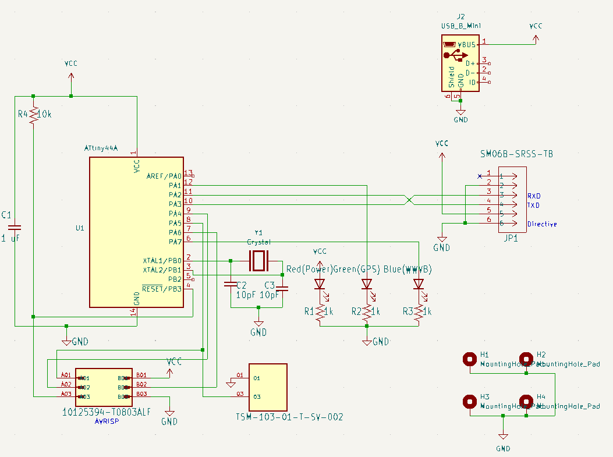
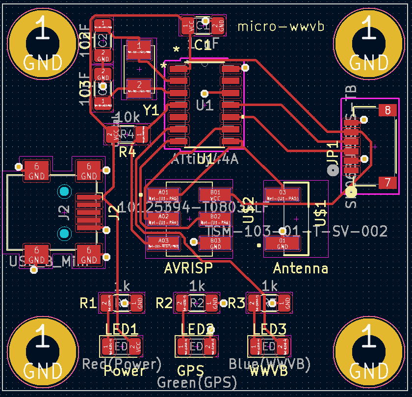

# &mu;WWVB: a tiny wwvb station

&mu;WWVB is a low power 60 khz [WWVB] transmitter used
to automatically set the time on radio synchronized clocks and wristwatches where the regular [WWVB] signal isn’t available. The system acquires
the correct time via GPS.





## Anish Athalye's project

I started with this 2016 github project.

-  His github project https://github.com/anishathalye/micro-wwvb.git 
-  His [blog post][micro-wwvb-post].

Thanks to Anish for making it available. 

## My situation

I live in Forest Grove, Oregon.  The opposite coast where Anish had his problem. I'm not able to reliably receive [WWVB], and especially not inside my house.  

I started searching for information on WWVB signals and ran 
across Anish's project.  It was perfect for what I wanted to do.

Anish seemed to have access to a lot of equipment for building the physical part of the stand.    I don't have access so I'm just going to be using a simple plastic box as a case.

I haven't made my own PC board since 1974.  A lot of taping was involved and then an etching bath.  I was pleased to discover open source schematic and printed circuit board editors.  I was
also pleased to discover online services which would accept design files, either as [gerber files](https://en.wikipedia.org/wiki/Gerber_format) or kicad pcb files, and mail you a finished PCB.

## KiCad

For my open source schematic/PCB editor I chose [KiCad].  I had never used it before.  So there was a bit of a learning curve.

### autorouting
Install the Freerouting plugin.
1. Open KiCad Project Manager
1. Click on Plugin and Content Manager
1. Find Freerouting
1. Click on install
1. Click on Apply Pending Changes.
1. You will have to have Java installed for it to work.


## PCB fabrication service

I used [Osh Park](https://oshpark.com) as my fabrication service.  They accept KiCad pcb files directly.  No need to export to gerber files.  The are the cheapest service I could fine.  Interestingly, they just happen to be local to me.

[WWVB]: https://www.nist.gov/pml/time-and-frequency-division/radio-stations/wwvb
[micro-wwvb-post]: https://www.anishathalye.com/2016/12/26/micro-wwvb/

[KiCad]: https://www.kicad.org/

## ATTiny44a-SSUR

AVR family of processors.  8 bit risc architecture.

14 pin Dual inline package
Surfuce mount device

Just notes an decoding the suffix.

- 4KiB flash
- SS - 14S1 package
- U - Matte tin
- R - Tape and real
- 14S1 - 14-lead, 3.90 mm Narrow Body, Plastic Small Outline Package (SOIC)

## WWVB signal

WWVB transmit on 60 khz for atomic watches and clocks. One bit of data is sent once every second.
60 seconds are required to send all the bits for the time.
- 0: Power reduced for .2 seconds.
- 1: Power reduced for .5 seconds.
- mark: Power reduced for .8 seconds.

## Software

The top level software

1. Initialize pins for LEDs,  GPS serial communication and for the antenna. 
1. Loop
   1. Acquire time from GPS module
   1. Send the 1 minute WWVB signal ten times.

The 60 khz signal is generated using the ATTiny's 16 bit counter, and associated wave form generator.
The pulse width modulation output, PA5 (pin 8), is used to generate the 60khz signal.
The software divides a second into two parts.  The first part is the reduced power signal.  Reduced power in our case means no signal is sent.  The second part is full power signal.  Here pulse width modulation is set to 50% duty cycle.

Actually, a 20 khz signal is generated.  We depend on the third harmonic.  Apparently Anish found this more effective.

Timing for the signal is accomplished using a library routine to delay a certain number of milliseconds. I believe the millisecond
delay is trasformed to a cycle count delay.

During the full power signal, the blue led is turned on. The led is connected to PA7 (pin 6).

| Source file | Description |
|-------------|-------------|
| microwwvb.c | Top level.  init, get time, transmit time.|
| gps.c       | Send and receive GPS module commands.     |
| hardware.h  | Constants for LEDs, serial port           |
| serial.c    | Send and receive ascii data. |
| led.c       | Show status on LEDs                       |

## Programming

For a description of using an arduino to program the micro-wwvb board see:

https://docs.arduino.cc/built-in-examples/arduino-isp/ArduinoISP

Here are the steps to use the arduino to program the micro-wwvb board.

1. Wire the Arduino to the micro-wwvb.
1. Program the Arduino as ISP.
1. Test program to make blue and green leds flash.
1. Update src/makefile
1. Program micro-wwvb

### Wire Arduino to the micro-wwvb

micro-wwwvb pin header, as seen when the usb connector is on the left.
<pre>
| miso  | vcc  |
| sck   | mosi |
| reset | gnd  |
</pre>

You'll need six male to female cables.

- miso - arduino 12
- sck - adruino 13
- reset - arduino 10
- vcc - arduino 5v
- mosi - arduino 11
- gnd - arduino gnd

Make sure to disconnnect the ferrite loop antenna during programming.

### Program the Arduino as ISP

- Connect Arduino uno to your laptop
- Start adrduino ide
- Select board: arduino uno
- Select comm: comm3 (for me)
- File / Examples/ Arduino ISP /ArduinoISP
- Sketch / Upload

## Test program to make blue and green leds flash

- File / Preferences
  - Select Show verbose output during compile and upload.
- Use the following sketch
- Select board: attiny44
- Select comm: com3 (for me)
  - You can use the windows device manager to help you find
    the com.  Look under Ports.
- Tools / Programmer / arduino as ISP
- Sketch / Upload using programmer

```c
// Flash blue and green LEDS.  Blue is on when green is off.
void setup() {
  pinMode(PA1, OUTPUT);
  pinMode(PA7, OUTPUT);
}

void loop() {
  digitalWrite(PA1, HIGH); 
  digitalWrite(PA7, LOW); 
  delay(100);
  digitalWrite(PA1, LOW);
  digitalWrite(PA7, HIGH);
  delay(100);
```

### Update src/makefile

The reason you turned on verbose mode in the previous step
was so you could see paths to various tools.  Look in the output window and look for the path to avr-gcc, avrdude, and avrdude-conf.
Then set the variables at the top of src/Makefile.

| Variable | Comment|
|----------|------------------------------------------------------|
| GBIN     | Should point to the directory containing avr-gcc.exe |
| DCONF    | Should point to avrdude.conf                         |
| DBIN     | Should be the directory containing avrdude.exe       

### Program micro-wwvb

Goto the src directory and run make.  I used cygwin make.

- make program-fuses
- make program

## LEDs

The LEDS will indicated status

| Time | LED states |
|------|-----|
| Program startup / top of loop                                          | Green and blue on for .1 seconds |
| Waiting for start bit from GPS modules                                 | Green  |
| Searching for the '$' at the start of the response from the GPS module | Blue |
| Complete response received from GPS module                             | Green on |
| Failure to receive expected response from GPS module                   | Green on for .1 seconds. |
| While transmitting WWVB signal                                         | Blue on for powered portion of the signal |

After startup, if the green and blue lights are stuck on,
you are not receiving anything from the GPS module.

After startup, if only the blue light is stuck on, 
you are receiving something from the GPS module, but the Initial '$' isn't being received.

If everything is working, you should see the Green light go solid, and the blue light flash
slowly with wwvb time data.

## Changes

### Board
My first attempt at the board was incorrect.  I got the order of the pins on the GPS connector backwards.  I didn't
realize the plug would have to be turned upside down to fit into the connector.  I fixed this for my
purposes by using a reversing cable.  

I have updated the KiCAD files to fix the pin ordering problem.   The images of the schematic and
the board have been updated too.  However, I'v never had these boards manufactured, and so never 
tested the latest board design.  I don't expect you will have problems, but if you do, you can start looking there.

### GPS module

The original GPS modules was the EM-506.  Due to the pin ordering problem, I
burned out the GPS module.  When I went to reorder it, it wasn't available.
It had been changed to the EM-506N5.  They are largely compatible.  However
the module is no longer initialized using $PSRF commands, instead a
proprietary command, $PAIR, is used.  The software and the bill of materials
has been updated to reflect the new module.
 

